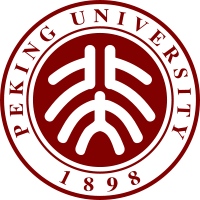
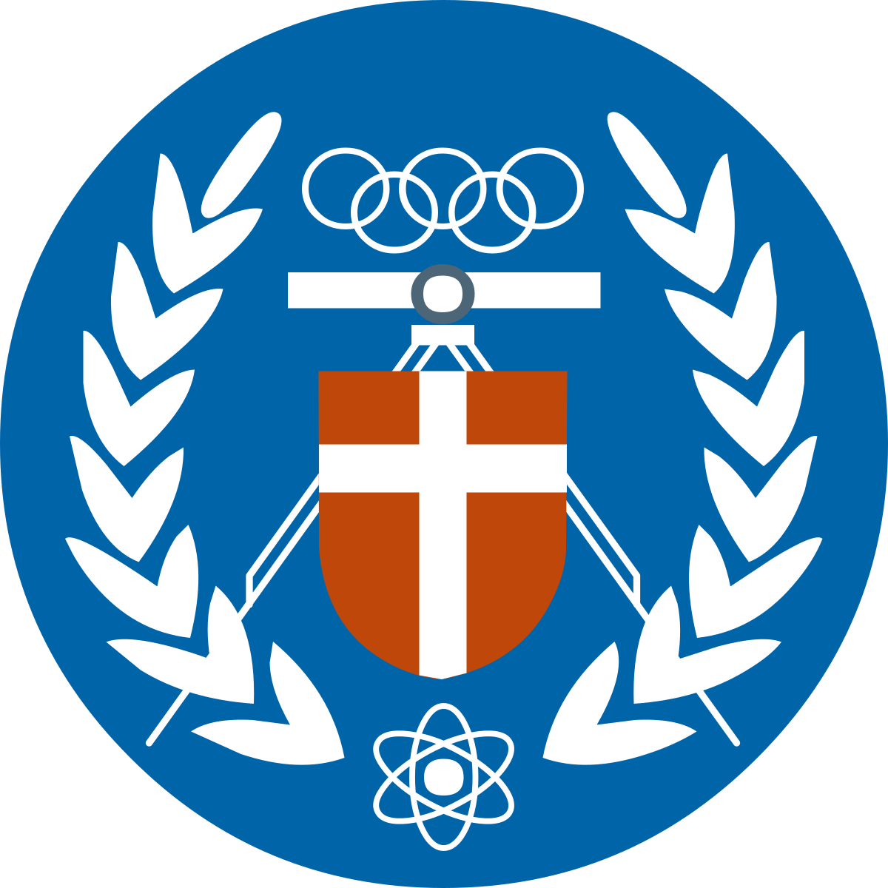

**Chang Huai-Yuan**

New Taipei, Taiwan  -  (+886) 0934027001  -  hamiltonchangwork@gmail.com / hamiltonchang@pku.edu.cn

## Professional Summary

Staff-level Applied Machine Learning Engineer and AI R&D Lead with 7+ years of experience building production AI systems across computer vision, edge AI, ML deployment, and enterprise LLM/RAG applications. Experienced in leading AI roadmap, mentoring engineers, and delivering commercial AI products from requirement clarification, data curation, model training, optimization, deployment, to production validation.

Strong hands-on background in object detection, face recognition, person re-identification, long-term tracking, TensorRT/CUDA optimization, edge deployment, and AI platform architecture. Currently leading an AI R&D team while remaining hands-on in selected product and project development.

## Education

* **Peking University, M.E. in Software Engineering**, Sept. 2017 - Aug. 2020

* **Chung Yuan Christian University, B.S. in Computer Science and Information Engineering**, Sept. 2013 - June 2017

## Experience

- **ioNetworks**, Taiwan, New Taipei

  **Assistant Technical Manager / AI R&D Lead**, Oct. 2025 - Present

  - Led a 6-7 member AI R&D team while remaining hands-on in key AI projects and product development, covering project planning, technical direction, task allocation, resource coordination, and delivery tracking.
  - Owned selected AI product initiatives from requirement clarification, feasibility assessment, model/system design, development, testing, deployment planning, to production delivery.
  - Introduced product-grade AI development and testing workflows, including task breakdown, acceptance criteria, technical review, testing strategy, and release readiness checks.
  - Worked with senior management, PM, RD, marketing, and external partners to evaluate technical requirements, clarify project scope, assess feasibility, and align AI roadmap with product and business priorities.
  - Drove applied AI development across computer vision, edge AI, production deployment, LLM/RAG applications, Codebase RAG, and internal engineering productivity tools.
  - Mentored engineers through technical review, project ownership assignment, capability assessment, performance evaluation, and individualized development planning.

  **Senior AI Algorithm Engineer**, Oct. 2022 - Oct. 2025

  - Developed commercial computer vision solutions across object detection, face recognition, person re-identification, pose estimation, and edge AI deployment.
  - Developed a training method combining unsupervised learning and knowledge distillation, improving YOLOv10n accuracy by 13.3% on COCO-minitrain; patent pending.
  - Collaborated with MediaTek on a ReID project for the 2024 ISC exhibition, achieving 91% accuracy under edge computing constraints and 83% accuracy in challenging scenarios.
  - Developed a bus stop mask detection model using General Focal Loss, attention mechanisms, and Bag of Freebies, achieving 88% validation accuracy under 70-degree camera tilt and long-distance detection.
  - Collaborated with Ambarella on Primax smart cameras for the 2023 CES exhibition, developing a real-time pose detection model on Ambarella chips with 97% validation accuracy.
  - Improved YOLOv5s accuracy from 37.4% to 43.0% without compromising speed using attention mechanisms, structural re-parameterization, auxiliary branches, and knowledge distillation.

- **Infortrend Technology**, Taiwan, New Taipei

  **AI Research and Development Engineer**, May 2021 - Jul. 2022

  - Led AI Service API and Resource Space projects, building production-oriented AI services for face detection, face recognition, and storage intelligence.
  - Improved face detection accuracy by about 2% without compromising inference speed through training strategy and Bag of Freebies optimization.
  - Improved face recognition on the AFD Asian face dataset, achieving 95.4% accuracy.
  - Used shared memory to synchronize face embedding databases across multiple processes and improved performance by about 3x.
  - Accelerated CPU inference by 3x using TensorFlow Lite with XNNPack.
  - Developed an Auto Tiering ML model for Infortrend storage systems, improving IO performance by at least 60% and achieving up to 92% prediction accuracy.

- **Patere Technologies, Inc.**, Taipei, Taiwan

  **Computer Vision Engineer**, Nov. 2020 - Jan. 2021

  - Developed speech fluency and confidence detection using rule-based audio features, RMS energy, vowel detection, and sliding-window analysis.
  - Developed remote interviewee attention detection using gaze direction and facial orientation, achieving about 80% accuracy, precision, and recall on the test set.

- **Lenovo Group Ltd, Lenovo Research**, Beijing, China

  **Computer Vision and AI Algorithm Intern**, Aug. 2019 - Nov. 2019

  - Developed a RetinaNet-based commodity detection model for unmanned containers and retail settings.
  - Improved commodity detection accuracy to 86% through targeted data collection, synthetic data, and training optimization.
  - Explored automated training systems to reduce manual engineering effort for product updates and releases.

- **Zero Zero Robotics**, Beijing, China

  **Computer Vision and AI Algorithm Intern**, Nov. 2018 - Aug. 2019

  - Implemented, maintained, and optimized long-term object tracking for Hover 2 drone development.
  - Integrated correlation-filter tracking and ReID strategies, improving tracking success rate by 15% and reducing CPU usage by 5%.

## Selected Projects

- **Production AI Development Workflow and Engineering Process**

  - Introduced spec-driven project development practices for AI projects, including requirement clarification, acceptance criteria, test planning, task breakdown, and delivery tracking.
  - Improved cross-functional communication between AI, PM, RD, marketing, management, and external partners by clarifying feasibility, ownership, and technical risks early.

- **Enterprise Codebase RAG and AI Knowledge Platform**

  - Designed internal knowledge systems using RAG, GraphRAG, codebase retrieval, and structured engineering knowledge to improve development productivity and technical onboarding.
  - Explored AST-based code chunking, symbol extraction, graph relationships, and hybrid retrieval for code understanding and agent-assisted development workflows.

- **Dynamic Intrusion Detection and Geometric AI Analysis**

  - Analyzed RGB-camera intrusion detection scenarios involving movable suspended square boundaries, human detection, pose/foot-point reasoning, camera geometry, and feasibility limits of monocular vision.

- **Design and Implementation of Real-time Long-term Single Person Tracking System**

  **Individual Work**, Nov. 2019 - Apr. 2020

  - Designed a two-branch long-term tracking system combining optimized OpenPose, SCNCD ReID, and optimized KCF for real-time edge-oriented person tracking.
  - Achieved 79.02% tracking success rate, 77.54% recall, and 12.87 FPS on CPU.

## Competition

* **IBM Watson Build Competition: Clothes Master**

  **Team Leader**, May 2018 - Jun. 2018

  - Won 2nd place in China by implementing a personal dress recommendation web application based on IBM Watson chatbot.
  - Designed the architecture and implemented key front-end and back-end features using JavaScript and Node.js.

## Skills

- Programming: Python, C++, SQL, JavaScript
- Machine Learning: PyTorch, TensorFlow, ONNX, TensorRT, OpenCV, TensorFlow Lite, XNNPack
- Computer Vision: Object Detection, Face Recognition, ReID, Tracking, Pose Estimation, Anti-Spoofing, Edge AI
- LLM and RAG: RAG, GraphRAG, Codebase RAG, Vector Search, Knowledge Graph, vLLM, Qdrant, Neo4j
- Deployment and Infrastructure: Docker, Kubernetes, FastAPI, Linux, REST API, Shared Memory
- Optimization and Debugging: CUDA, TensorRT, PyCUDA, NVTX, Nsight Systems, gdb, pdb, git
- Leadership: AI Roadmap, Project Planning, Task Allocation, Technical Review, Performance Evaluation, Cross-functional Communication
