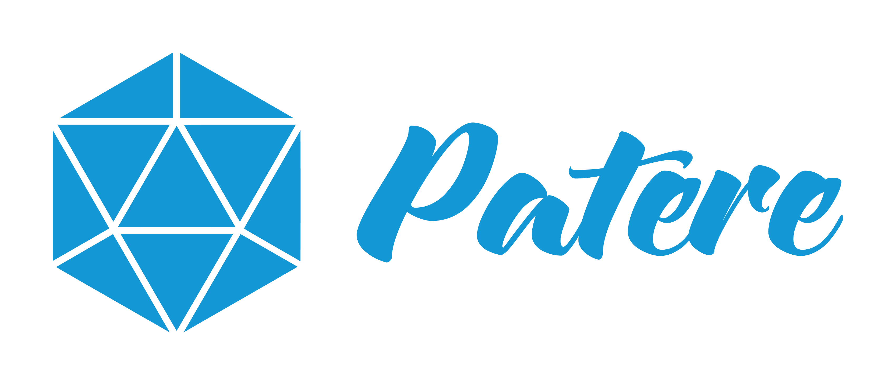

**張懷元 Hamilton Chang**

<!-- **應聘職位: AI演算法工程師** -->

台灣 新北, (+886) 934027001, hamiltonchangwork@gmail.com / hamiltonchang@pku.edu.cn

## 學歷
* **北京大學**  軟體工程系  碩士學位  2017.9-2020.8

* **中原大學**  資訊工程學系  學士學位  2013.9-2017.6

## 工作經驗

* **艾陽科技股份有限公司**                                 台灣 新北

  **AI演算法資深工程師**  2022.10-現在
  * 結合**無監督學習與知識蒸餾所設計的新型模型訓練方法**，**提升YOLOv10n在COCO-minitrain上13.3%的準確度**，提供組員開發相關模型提升準確度的工具，該項技術正在申請專利
  * 與MTK合作Re-Identification項目參加2024 ISC展覽，設計重找尋(Re-identification)策略，在ＭTK邊緣計算晶片上讓ReID在有限制條件下，達到91%的準確度;在困難場景，依然有83%左右的準確度
  <!-- * ~~MTK LPDR, Traffic flow(deploy)~~ -->
  * 開發公車站口罩偵測模型：利用General Focal Loss、注意力機制以及BoF等方法，**在驗證集（包含攝影機俯角達到70度與遠距離偵測）中達到88%的準確率**
  * 與Ambarella合作致伸(Primax)智能相機參加2023 CES展覽，在Ambarella晶片上開發即時姿態檢測模型。**在驗證集上達到97％的準確度**
  * **YOLOv5s在不降低運行速度的前提下，準確度從37.4%提升到43%**。通過注意力機制、結構重新參數化、deep surprivsion(auxiliary branch)以及知識蒸餾等方法

* **普安科技股份有限公司**                                 台灣 新北

  **AI研發工程師**  2021.5-2022.7

  * AI Service API和Resource Space：
    <!-- * 用Triton Inference Server作為主體架構，將開發成本從20人減少至8人 -->
    <!-- * 用MTCNN和CenterFace作為偵測的基底模型，辨識方法則適用FaceNet和ArcFace供使用者選擇 -->
    * 人臉偵測採用BoF訓練方式，**在不增加推論時間的前提下，增加2％的準確度**
    * 人臉辨識在亞洲人臉AFD微調，準確度達到95.4%
    * 用共享記憶體解決多行程間共用人臉特徵資料庫的問題，**提高3倍的比對時間**
    <!-- * 用量化技術和特定硬體平台加速框架(TensorRT)**改善模型約5倍的速度** -->
    <!-- * 利用dockerfiles中Multi-Stage、刪除多餘依賴等技術**將映像檔從13GB減少至7GB** -->
    * 利用Tensorflow Lite框架與加速插件庫XNNPack，將模型**在通用CPU平台上的推論速度提升至少3倍**
  * 實現Auto Tiering模型給普安儲存系統，**提升至少60%的IO效能**
    * 第一版方案：按照論文採用XGBoost預測未來1~6小時檔案是否會被存取。但按照需求進行未來24小時的預測，準確度最高能達到80%
    * 最終方案：基於第一版方案增加檔案類型等特徵，以及增加間隔的次數，並改用回歸模型預測未來一段時間檔案的熱度，**準確度最高能達到92%並提升60%的IO效能**

  <!-- * 用Nsight System和NVTX分析人流系統運行緩慢的原因，**改變TensorRT模型使用方法提高約15%的性能** -->
  <!-- * 將內容管理系統從NVIDIA Nano(ARM)移植到普安伺服器(x86)，並用CI/CD建置docker映像再佈署到機器 -->
  <!-- * 負責AI Service API和Resource Space項目中AI模型和系統的開發與封裝
    * 用Triton Inference Server作為主體架構，將開發成本從20人減少至8人
    * 實現人臉辨識API
      1. 用MTCNN作為偵測的基底模型，並提供FaceNet和ArcFace辨識方法供使用者選擇
      2. 用共享記憶體解決多process間共用人臉特徵資料庫的問題，並**提高3倍的比對時間**
      3. 用量化技術和特定硬體平台加速框架(TensorRT)**改善模型約5倍的性能**
    * 利用dockerfiles中Multi-Stage、刪除多餘依賴等技術**將映像檔從13GB減少至7GB**
    * 利用Tensorflow Lite框架與加速插件庫XNNPack將模型**在通用CPU平台上的推論速度提升至少3倍**
  * 實現Auto Tiering模型給普安儲存系統，**提升至少60%的IO效能**
    * 按照論文實現預測未來1~6小時檔案是否會被存取的模型，但規格要預測24小時的情形下，準確度最高只能達到80%
    * 基於第一版方案增加特徵並改用回歸模型預測未來一段時間檔案的熱度，**準確度最高只能達到95%並提升60%的IO效能** -->

* **澎特科技有限公司**                                         台灣  台北

  **計算機視覺演算法工程師**  2020.11-2021.1

  * 通過語音的特性來偵測面試者的自信程度與說話流暢。先設計與實現rule-based方法，基於RMS能量讓偵測面試者自信程度的錯誤率低至21%；基於元音偵測以及滑窗，計算每個元音的頻率得到72%的準確度；接著研究更有效、複雜且適用於機器/深度學習的特徵方法，如: MFCC、FBank等
  * 開發遠端面試者專注度檢測項目：通過檢查面試者的視線與面部朝向來確認該面試者是否專注，在測試集上準確度、精確度和招回率都有80%左右

* **聯想集團有限公司  研究院**                           中國  北京

  **計算機視覺AI演算法實習生**  2019.8-2019.11
  * 無人商店
    * 主要負責開發商品檢測模型
    * 開發基於RetinaNet的商品檢測模型，應用在無人貨櫃與商店，並分析檢測成功率低的原因
    * 通過蒐集、產生更複雜的資料，以及BoF，快速重新訓練模型，檢測準確度達86%
    * 與主管討論其中有趣的的研究方向：研究與開發自動化訓練系統，目的是解決未來實際應用中開發人員介入每次商品更新或是上架等問題

* **杭州零零科技有限公司北京分公司**              中國  北京

  **計算機視覺AI演算法實習生**  2018.11-2019.8

  * Hover 2無人機
    * 負責開發、維護與優化長期目標追蹤功能
    * 研究與優化相關濾波，加入至目標追蹤功能中，**再通過增加約束條件與修改目標重識別策略讓無人機的跟蹤成功率提升15%、CPU佔有率降低5%**

## 項目

* **實時長期單人追蹤系統的設計與實現**

  **個人項目**   2019.11-2020.4

  * 目標是在邊緣計算裝置上，達到長期穩定與即時追蹤
  * 採用雙軌追蹤模：一是用優化後的OpenPose作為行人偵測模型，加上SCNCD的ReID方法；二是採用優化後的KCF作為通用追蹤方法。以OpenPose的支線為主線，用KCF作為輔助。
  * 將跟蹤分為三個狀態，目標選擇、追蹤與找回，並以此為基礎設計與實現各種輔助策略達到。如：隔幀檢測、衝突檢測、追蹤器相互約束機制以及目標範圍排除等等
  * **追蹤成功率為79.02%；招回率77.54%；FPS為12.87**

* **2D動畫人物辨識**  

  **組長**   2018.5-2018.6

  * 目標是辨識不同繪師筆下的相同動畫人物，為北京大學軟微學院與微軟合作的課程項目
  * 用預訓練好的LBPcascade去偵測動畫人臉，用Inception-V3進行人物辨識，通過遷移學習訓練分類器
  * **TOP1的結果是 73.25%，進入前6名**

<!-- * **C++版本的Scheme語言直譯器**

  **個人項目**  2017.3-2017.5

  * 分析Scheme程式碼結構來完成Scanner及Parser的切割、Binding與報錯機制
  * 將Scheme的程式碼轉成設計的樹狀結構邏輯

* **基於樹梅派的臉部辨識門禁系統**

  **組長**   2016.2-2016.11

  - **用C++及OpenCV實現。目的是學習與應用人臉識別及人臉前處理等技術**
  - 軟體系統分為建立人臉鑰匙與辨識兩部分，系統控制樹莓派發送訊號(電流)至繼電器控制電磁式感應門鎖 -->

## 比賽

- **IBM Waston Build大賽: 衣大師   全中國第二名**

  **組長**  2018.5-2018.6

  - 基於IBM Watson聊天機器人實現個人衣服穿搭推薦網頁
  - 使用Javascript與Node.js實現前後端，以及負責整體架構與主要功能的設計與實現

## 技能

* 程式語言: Python、C++
* 機器學習框架: PyTorch、TensorFlow
* 其他: git、gdb、Docker、pdb