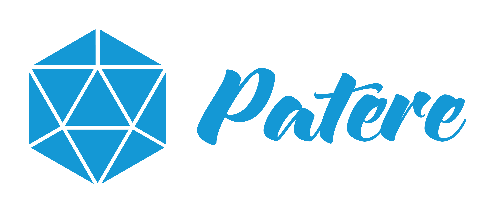

**張懷元 Hamilton Chang**

**應聘職位: 電腦視覺與AI研發工程師**

台灣 嘉義, (+886) 0934027001, hamiltonchangwork@gmail.com / hamiltonchang@pku.edu.cn

## 學歷

* **北京大學**  中國  北京

  軟體工程系  碩士學位  2017.9-2020.8

  * 畢業論文：實時長期單人跟蹤系統的設計與實現

* **中原大學**  台灣  中壢

  資訊工程學系  學士學位  2013.9-2017.6

  * 畢業專題：基於樹梅派的臉部辨識門禁系統

## 工作經驗

* **普安科技股份有限公司**                                 台灣 新北

* **AI研發工程師** 2021.5-現在

  * 通過Nsight System和NVTX分析NVIDIA Xavier上人流分析系統運行緩慢的原因，用改變TensorRT的使用方法提高約15%的性能。
  * 完成內容管理系統(CMS)移植: 從NVIDIA Nano移到普安伺服器(x86)上，並用CI/CD自動化建置docker映像再佈署到普安的設備上。
  * 主導AI Service API和Resource Space項目
    * 用Triton Inference Server作為主體架構，並選用ONNX, TensorRT和Python後端，將開發成本從30人減少至5人。
    * 開發人臉辨識API:
      1. 研究人臉偵測(MTCNN、CenterFace、RetinaFace等等)與辨識(FaceNet、CosFace、ArcFace等等)模型，並選擇MTCNN作為偵測的基底模型，提供FaceNet和ArcFace供使用者作選擇。
      2. 在人臉特徵資料庫上採用共享記憶體和KD-Tree結構，解決多process間的溝通問題，並提高3倍左右的比對時間。
      3. 利用剪枝、量化技術和特定硬體平台加速庫(TensorRT)來改善模型的性能。
    * 利用dockerfiles中Multi-Stage、刪除多於依賴等技術來封裝項目，並將此docker映像從13GB減少至7GB。
    * 利用Tensorflow Lite框架與加速插件庫XNNPack將模型在通用CPU平台上的推論速度提升至少3倍。
  * 實現Auto Tiering模型在儲存系統上，並提升至少60%的IO效能。
    * 因儲存系統性能限制而選用機器學習方法而非深度學習。
    * 按照論文實現預測未來一段時間(1~6小時)該檔案是否會被存取的方法，但由於規格需要預測起碼未來一天而造成結果不甚理想。
    * 基於第一版方案改進用回歸模型預測未來一段時間檔案的熱度，並提升60%的IO效能。

* **澎特科技有限公司**                                         台灣  台北

  **計算機視覺演算法工程師**  2020.11-2021.1

  * 研究如何只通過語音檢測，得知面試者的自信程度與說話流暢度，並用基礎語音特性設計與實現rule-based方案後，再研究更有效與複雜特徵與方法，如:MFCC、FBank等更適用於機器/深度學習的特徵
  * 參與面試者專注度檢測項目，並在錄製的數據集與抓取的少量測試集中，accuracy、precision與recall都要80%左右的表現

* **聯想集團有限公司  研究院**                           中國  北京

  **計算機視覺AI演算法實習生**  2019.8-2019.11

  * 開發基於RetinaNet的商品檢測自動化訓練系統，應用場景是無人貨櫃與無人商店，並通過測試結果分析檢測成功率低的原因
  * 通過蒐集與產生更複雜並合適的數據並來重新訓練模型，檢測成功率為86%

* **杭州零零科技有限公司北京分公司**              中國  北京

  **計算機視覺AI演算法實習生**  2018.11-2019.8

  * 參與Hover 2無人機開發
    * 研究並測試目標跟蹤與模板匹配，並分析各自的優劣
    * 開發、維護與優化長期目標跟蹤功能
    * 通過增加約束條件與修改目標重識別策略讓長期目標跟蹤功能成功率提升15%、CPU佔有率降低5%
  * 設計與研究雙目人臉辨識門禁系統
    * 研究人臉偵測與辨識相關演算法(MTCNN、FaceNet、以及FaceBoxes)
    * 嘗試用雙鏡頭實現活體檢測

## 比賽

* **IBM Waston Build大賽: 衣大師   全中國第二名**

  **組長**  2018.5-2018.6
  * 基於IBM Watson聊天機器人實現個人衣服穿搭推薦網頁
  * 使用Javascript與Node.js實現前後端，以及負責整體架構與主要功能的設計與實現

## 項目

* **實時長期單人跟蹤系統的設計與實現**

  **個人項目**   2019.11-2020.4

  * 通過電腦CPU模擬無人機跟蹤行人的情況
  * 採用基於姿態檢測的跟蹤與目標跟蹤兩種跟蹤器同時進行跟蹤
  * 將跟蹤分為三個狀態，目標選擇、跟蹤與重找回，以方便進行設計與實現
  * 設計與實現各方法輔助跟蹤演算法達到長期穩定與實時跟蹤的目標。如：隔幀檢測、衝突檢測、跟蹤器相互約束機制以及目標範圍排除等等
  * 採用個人收集與採集的無人機數據集進行測試
  * **跟蹤成功率為79.02%；招回率77.54%；FPS為12.87**

* **基於CNN的2D動畫人物辨識**  

  **組長**   2018.5-2018.6

  * 北京大學軟微學院與微軟合作的課程項目，進入最終階段評比
  * 嘗試不同繪師筆下的相同動畫人物是否能成功辨識為同一角色
  * 使用他人訓練好的LBPcascade去偵測動畫人臉
  * 使用TensorFlow官方的Inception-V3進行人物辨識，通過遷移學習(fine-tuning)訓練分類器
  * **TOP1的結果是 73.25%**

* **C++版本的Scheme語言直譯器**

  **個人項目**  2017.3-2017.5

  * 分析Scheme程式碼結構來完成Scanner及Parser的切割、Binding與報錯機制
  * 將Scheme的程式碼轉成設計的樹狀結構邏輯

* **基於樹梅派的臉部辨識門禁系統**

  **組長**   2016.2-2016.11

  - **採用C++及OpenCV實現。目的是學習與應用人臉識別及人臉前處理等技術，實現的過程中在安全性(嚴格辨識結果)與實用性(流暢使用)兩者中取得平衡**
  - 軟體系統分建立人臉鑰匙與辨識兩部分，後期將軟體系統移植至樹莓派，並通過發送訊號(電流)至繼電器控制電磁式感應門鎖

## 技能

* 程式語言: C、C++、Java、R、Python
* 其他: Git、gdb、Docker、pdb

